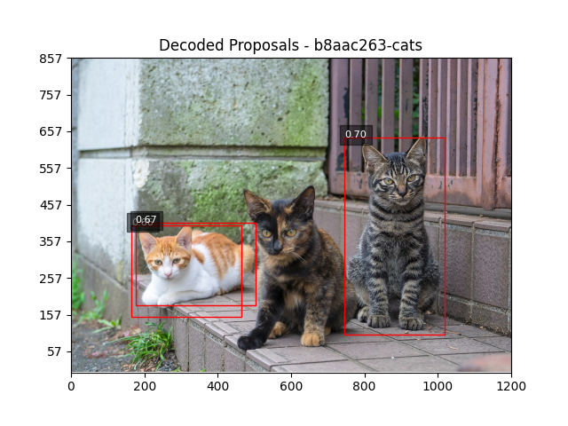
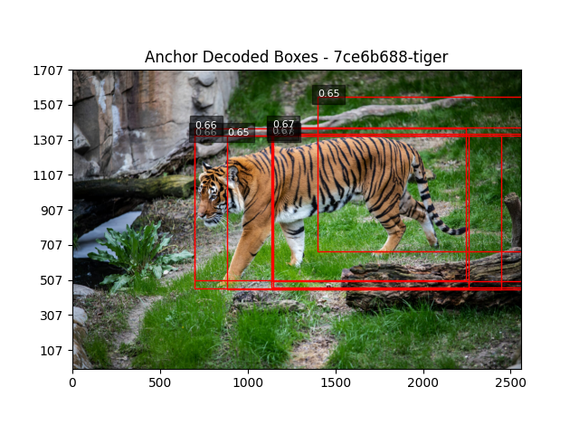
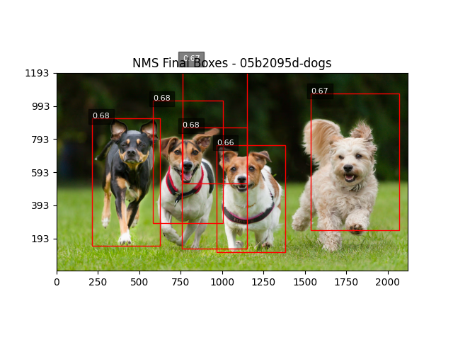
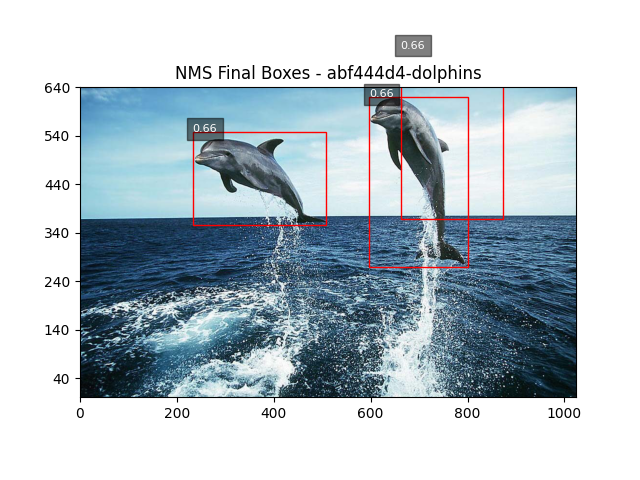

# ============================
# README: Homework 3 - Q1–Q5
# ============================

This assignment walks you through the core components of a Region Proposal Network (RPN) using bounding boxes and COCO-style annotations. You will **not** be training a network — instead, you will implement the full RPN pipeline including tensor generation, decoding, anchor encoding, and non-maximum suppression.

Each job corresponds to a specific step in the pipeline.

- ✅ Ground Truth Tensor Generation
- 🔍 Decoding Patch-Based Proposals
- 📦 Anchor-Based Encoding
- 🧩 Anchor-Based Decoding
- 🧹 Non-Maximum Suppression (NMS)


## 📁 Project Structure

```bash
├── main.py              # Main script (contains all jobs)
├── test_rpn_utils.py    # test script (contains tests for all jobs)
├── Readme.md            # a readme file
├── result/              # Folder to save tensors and results
├── data/
│   ├── images/          # Folder with input images (.jpg)
│   ├── task2/           # Folder with input and expected output for job 2
│   ├── task4/           # Folder with input and expected output for job 4
│   ├── task5/           # Folder with expected output for job 5
│   ├── coco.json        # COCO-style annotations
│   └── anchors.json     # Anchor shape definitions (e.g., [[1,1],[2,1],[1,2]])
```


## 📤 Submission Instructions


Submit a `.zip` file named:


Your `.zip` file **must contain** the following:

- ✅ `main.py` — your completed Python script  
- ✅ `result/` folder — all generated output files:
  - `.png` files (visualizations and figures)
  - `.npz` files (tensors and intermediate data)
- ✅ `report.pdf` — a **single-page** PDF describing your solutions 
  - Font size **no smaller than 12**

> 🚨 **IMPORTANT:**  
> All jobs should run in **reasonable time** — ideally **less than 5 minutes per job**.  
> Missing **any** of the required files (`main.py`, outputs in `result/`, or `report.pdf`) will result in a **grade penalty**.  
> You need to save images for the **task 2, 4 and 5 by yourself** in the result folder and submit it. Create a folder per task in the result and put images for each task in it.  
> There is a unit test file, `test_rpn_utils.py,` which you can run to determine if your code is correct. The unit test is not complete, so there is a chance by passing all the tests, you still have some problems, but it is helpful. Read more about it at the end of this document.

---

### 🤝 Collaboration Policy

You may **discuss** the homework with your classmates, but:

- You must **write your own code and solutions**
- You **may not divide the work and exchange answers**
- Your `.py` file must be **written by you individually**
- Submissions that are too similar will be flagged

#### 🧾 Acknowledgement

At the **end of your `main.py`**, include a list of classmates you discussed the homework with, in this format (one per line):

```
# Wei-Lun Chao, chao.209
# Jane Doe, doe.123
```
Refer to the syllabus for complete academic integrity guidelines.


## Requirements

This project requires Python 3 and the following Python libraries:

- `numpy`
- `pillow`
- `matplotlib`

You can install the dependencies using pip:

```bash
pip install numpy pillow matplotlib
```


---

## Question 1: Naïve Ground Truth Tensor Generation (40 points)

### Objective:
Generate patch-level ground truth tensors from annotated images to simulate the output of a simple RPN.

### Setup:
- Resize input images to 200x200.
- Divide each resized image into a 40×40 grid of 5×5 patches.

### What to read:
- Please see `main` after `args.job_number == 1:`, `resize_image_and_boxes`, `compute_patch_grid`, `boxes_overlap` and `generate_gt_tensors` functions.

### Where to implement:
- Please fill `resize_image_and_boxes`, `compute_patch_grid`, `boxes_overlap` and `generate_gt_tensors` functions.

### Tasks:
1. Resize the image and its bounding boxes to 200x200.
2. For each patch:
   - If any GT box overlaps the patch:
     - Mark `Existence[row, col] = [1, 0]`
     - Randomly pick one overlapping box and write `[x_center, y_center, width, height]` into the `Location` tensor.
   - Otherwise, mark `Existence[row, col] = [0, 1]`

### Output:
- `1_Existence_tensor_<image_name>.npz`
- `1_Location_tensor_<image_name>.npz`

There are six images, and each of them will create two files; then, you need to submit 12 files, which will automatically save in the result if you put `--save` in your command while running the code.

### Visualization (Optional):
- Overlay GT boxes on the resized image with patch boundaries.

### Command Example:
```bash
python main.py --job_number 1 --image_folder data/images --annotation_file data/coco.json --display --save
```

## Question 2: Decode Ground Truth Tensors (10 points)

### Objective:
Convert the existence and location tensors back into bounding box proposals for visualization and evaluation.

### What to read:
- Please see `main` after `args.job_number == 2:`, `decode_tensors` function.

### Where to implement:
- Please fill `decode_tensors` function.

### Tasks:
- Iterate over each grid cell.
- If `Existence[row, col, 0] > threshold`, decode the location tensor at that cell.
- Convert `[x_center, y_center, width, height]` to original image scale.

### Command Example:
```bash
python main.py --job_number 2 --image_folder data/images --annotation_file data/coco.json --tensor_folder data/task2 --threshold 0.65 --display
```

you can paly with different thresholds to see more or less bboxes

### Output:
- You need to save all the images in the result folder and submit them with the rest of the files.
- Printed list of decoded boxes (3 boxes) for image.
```bash
[x_center=881.6, y_center=371.1, width=271.6, height=537.7, conf=0.70]
[x_center=315.3, y_center=276.1, width=299.4, height=251.0, conf=0.66]
[x_center=339.4, y_center=295.1, width=327.8, height=223.7, conf=0.67]
```
##### Expected Output



## Question 3: Anchor-Based Encoding (30 points)

### Objective:
Implement anchor-based encoding by labeling each patch location and anchor shape based on how well it matches the ground truth boxes.

### Setup:
- Use a set of predefined anchor shapes (e.g., `[[1, 1], [2, 1], [1, 2]]`) provided in a JSON file.
- At each patch center, generate anchor boxes based on the anchor shapes and patch size.

### What to read:
- Please see `main` after `args.job_number == 3:`, `compute_iou` and `match_anchors_to_ground_truth` functions.

### Where to implement:
- Please fill `compute_iou` and `match_anchors_to_ground_truth` functions.

### Tasks:
1. For each image:
   - Resize image and GT boxes to 200x200.
   - Compute the patch grid (40x40 patches of size 5x5).
2. For each anchor shape and each patch:
   - Place an anchor box at the patch center.
   - Compute IoU between the anchor and all GT boxes.
   - Track the best IoU for each location.
   - If the current anchor has the best IoU and is greater than zero:
     - Set `Existence[row, col] = [1, 0]`
     - Encode the GT box as offsets `[dx, dy, dw, dh]` from the anchor box.
   - Otherwise, set `Existence[row, col] = [0, 1]`.

### Output:
- One pair of tensors per anchor shape per image:
  - `3_Anchor_<k>_Existence_tensor_<image_name>.npz`
  - `3_Anchor_<k>_Location_tensor_<image_name>.npz`

There are six images, each creating two files for each anchor. Then, for this part, you need to submit 36 files, which you put `--save` in your command while running the code, and the result will automatically be saved in the result folder.


### Visualization (Optional):
- Display the image and overlay positive anchor boxes for visual inspection.

### Command Example:
```bash
python main.py --job_number 3 --image_folder data/images --annotation_file data/coco.json --anchor_file data/anchors.json --tensor_folder result --display --save
```


## Question 4: Anchor-Based Decoding (10 points)

### Objective:
Decode anchor-based existence and location tensors back into bounding box proposals using the predicted offsets and anchor configurations.

### Setup:
- Load anchor shapes (e.g., `[[1, 1], [2, 1], [1, 2]]`) from `anchors.json`.
- For each patch and anchor:
  - The base anchor box is placed at the patch center using the anchor's shape.
  - The model predicts offsets `[dx, dy, dw, dh]` to adjust this anchor.

### What to read:
- Please see `main` after `args.job_number == 4:`, `decode_anchor_grid_predictions` function.

### Where to implement:
- Please fill `decode_anchor_grid_predictions` function.


### Tasks:
1. For each image:
   - Load the corresponding anchor-based existence and location tensors for each anchor shape.
2. For each anchor and patch location:
   - If `Existence[row, col, 0] > threshold`, decode the box:
     - Compute the anchor center.
     - Apply offsets to anchor to get `[x_center, y_center, width, height]`.
     - Scale decoded box from resized image (200x200) to original image size.

### Output:
- A list of predicted boxes per image across all anchors with confidence scores.
- You need to save all the images in the result folder and submit them with the rest of the files.


### Visualization (Optional):
- Display original image with all decoded proposals drawn in blue and labeled with confidence scores.

### Command Example:
```bash
python main.py --job_number 4 --image_folder data/images --annotation_file data/coco.json --anchor_file data/anchors.json --tensor_folder data/task4 --display
```

##### Expected Output





## Question 5: Anchor Decoding with Non-Maximum Suppression (NMS) (10 points)

### Objective:
Improve the quality of decoded bounding boxes by applying Non-Maximum Suppression (NMS) to remove redundant overlapping predictions.

### Setup:
- Perform the same decoding procedure as in Question 4.
- Apply NMS to the union of all anchor-decoded boxes for each image.

### What to read:
- Please see `main` after `args.job_number == 5:`, `non_max_suppression` function.

### Where to implement:
- Please fill `non_max_suppression` function.


### Tasks:
1. For each image:
   - Load and decode anchor-based tensors as in Q4.
   - Gather all predicted boxes with `Existence[..., 0] > threshold`.
2. Apply Non-Maximum Suppression:
   - Sort boxes by confidence score.
   - Iteratively keep the highest-confidence box and remove others with IoU > threshold.
   - Final result is a non-overlapping set of high-confidence proposals.

### Output:
- A filtered list of bounding boxes per image with minimal overlap.
- Boxes are sorted by confidence and pruned using NMS.
- You need to save all the images in the result folder and submit them with the rest of the files.

### Visualization (Optional):
- Display the final set of proposals after NMS on the original image.

### Command Example:
```bash
python main.py --job_number 5 --image_folder data/images --annotation_file data/coco.json --anchor_file data/anchors.json --tensor_folder data/task4 --threshold 0.65 --display
```

##### Expected Output




# 🧪 Unit Tests for Region Proposal Network (RPN) Modules

This directory contains unit tests for verifying the functionality of key components in the Region Proposal Network (RPN) pipeline used in Homework 3.

---

## 📁 Test Coverage

The following functions are tested:

| Function Name              | Description                                                  | # of Test Cases |
|---------------------------|--------------------------------------------------------------|-----------------|
| `resize_image_and_boxes`  | Resizes image and scales bounding boxes                      | 3               |
| `compute_patch_grid`      | Generates patch grid over the image                          | 3               |
| `boxes_overlap`           | Checks if two bounding boxes overlap                         | 3               |
| `generate_gt_tensors`     | Produces GT tensors from bounding boxes                      | 3               |
| `compute_iou`             | Calculates Intersection over Union (IoU) between boxes       | 3               |
| `non_max_suppression`     | Applies NMS to suppress redundant overlapping predictions     | 3               |
| `change_coordinates`      | Transform a bounding box from a top-left system to bottom-left| 3               |

Total Test Cases: **21**

---

## ▶️ How to Run the Tests

### Prerequisites

- Python 3.7+
- Required Python packages: `numpy`, `Pillow` and `unittest`

---

### 🔧 Command

From the project root directory, run:

```bash
python -m unittest test_rpn_utils.py
